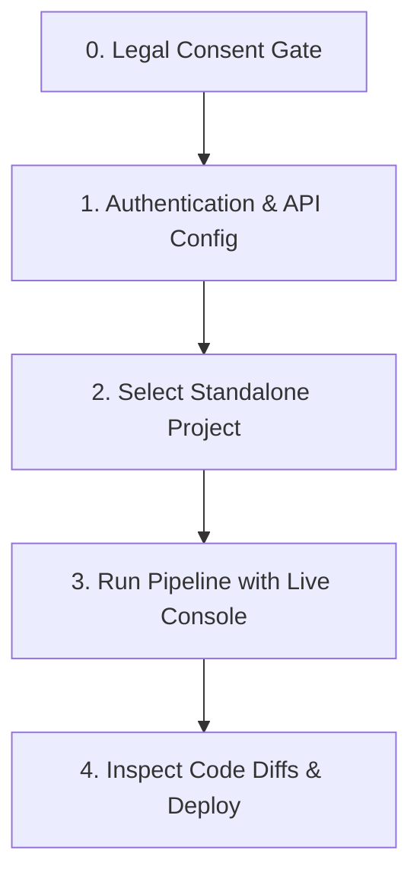

# ⚡ LiberateJS Installation & Onboarding Guide

Welcome to **LiberateJS**! This developer utility allows you to decouple and migrate web applications from proprietary Standalone ecosystems into standard, standalone React and Node.js codebases.

This guide covers everything you need to set up LiberateJS, run it locally, navigate the visual dashboard (with live logs and code diffs), and troubleshoot common errors.

---

## 📋 Table of Contents
1. [Prerequisites](#-prerequisites)
2. [Installation & Setup](#%EF%B8%8F-installation--setup)
3. [Running LiberateJS](#%EF%B8%8F-running-liberatejs)
   - [CLI & Script Commands](#cli--script-commands)
   - [Local Dashboard Server](#local-dashboard-server)
4. [Local Dashboard Navigation](#%EF%B8%8F-local-dashboard-navigation)
   - [Phase 1: Credentials Setup](#phase-1-credentials-setup)
   - [Phase 2: Project Selection](#phase-2-project-selection)
   - [Phase 3: Live Progress Console](#phase-3-live-progress-console)
   - [Phase 4: Real-time Code Diff](#phase-4-real-time-code-diff)
5. [Troubleshooting & FAQs](#%EF%B8%8F-troubleshooting--faqs)

---

## 🔍 Prerequisites

Before running LiberateJS, ensure your local workstation has the following system dependencies installed and configured:

### ⚙️ System Dependencies
*   **Node.js (v18.0.0+)**: Required to run the local dashboard bridge server (`ui/server.js`) and the automated cleanser script (`scripts/decouple-cleanse.js`) to decouple and compile React projects.
*   **Git**: Required for initializing version control in the migrated workspace and staging the new codebase.
*   **GitHub CLI (`gh`)** *(Optional but recommended)*: Highly recommended to automate GitHub repository provisioning and push directly from the migration pipeline.

### 🔑 Authentication Credentials
*   **Standalone Credentials**: Your platform login email (`STANDALONE_EMAIL`) and password (`STANDALONE_PASSWORD`).
*   **GitHub Personal Access Token (PAT)**: A GitHub PAT with `repo` scopes. This is required to push the migrated project if your local Git client is not authenticated with the GitHub CLI.

---

## 🛠️ Installation & Setup

You can register LiberateJS as a global tool on your machine. This packages the cleansing scripts, AST rewriters, and visual UI into your IDE configurations:

### Powershell Automated Install (Windows)
Run the provided installer script in your PowerShell console:
```powershell
./install.ps1
```

**What the installer does:**
1. Verifies that **Git** and **Node.js** are present in your system PATH.
2. Checks for **GitHub CLI (`gh`)** and reports status.
3. Initializes global config paths under `~/.gemini/config/skills/liberatejs/`.
4. Deploys the CLI script, AST rewriter, launcher batch scripts, and UI assets to the global directories.

---

## 🚀 Running LiberateJS

### CLI & Script Commands

If you prefer to operate directly from the terminal without the visual dashboard, you can trigger the JavaScript cleanser script directly.

#### 1. Running the CLI Tool Directly
Navigate to the directory of the project to cleanse, and run:
```powershell
node path/to/bin/liberate.js --src . --rename "my-standalone-app" --recipe path/to/recipe.json
```

**Supported Options:**
*   `-s, --src <path>`: The target source project folder containing the app to decouple (default: `.`).
*   `-d, --dest <path>`: The destination folder where the clean app should be created (leaves source untouched if different).
*   `-n, --rename <name>`: Sets the new name for the project in `package.json` (e.g., updates metadata).
*   `-r, --recipe <path>`: Path to the JSON recipe file (e.g., `recipes/standalone.json`) defining the file deletion paths, package renaming, and string replacements.
*   `--stage <cleanse|rewrite|all>`: Run specific pipeline stages (default: `all`).
*   `--dry-run`: Runs checks and lists files to modify/delete without writing changes.
*   `-v, --verbose`: Enable detailed logs.

#### 2. Running using the `npx` Wrapper
```bash
npx liberatejs@latest --src ./proprietary-app --dest ./liberated-react-app
```

---

### Local Dashboard Server

LiberateJS features a glassmorphic dashboard UI that manages configuration, project selection, real-time logging, and code differences.

To start the local bridge server:
1. Double-click **`run-dashboard.bat`** (on Windows) or execute:
   ```bash
   node ui/server.js
   ```
2. The server will spin up on **`http://localhost:4444`** and automatically launch your default browser.

---

## 🖥️ Local Dashboard Navigation

The dashboard guides you through the migration lifecycle in five steps:



### Phase 0: Legal Consent Gate
*   **Acknowledge Risks**: Read the compliance guidelines regarding IP access rights, platform ToS violations, and account risks.
*   **Consent Checkbox**: Tick the confirmation box: *"I represent that I have legal ownership/access rights..."*
*   *Note: Phase 1 (Credentials Setup) remains locked and blurred out until this consent is explicitly checked.*

### Phase 1: Credentials Setup
*   **Standalone Login**: Enter your platform email and password. Click **Save & Verify Standalone**. This triggers an authentication request to load your profile.
*   **GitHub Auth**: Enter your PAT token and default git name/email. Click **Save & Verify GitHub**.
*   *Note: These details are securely stored in your browser's local storage and passed locally to the bridge server config API.*

### Phase 2: Project Selection
*   Once Standalone is connected, the **Available Projects** dropdown unlocks.
*   The dashboard fetches your active cloud projects. Select the repository you want to liberate.

### Phase 3: Live Progress Console
Click **Start Conversion** to trigger the pipeline. You will see a live progress bar tracking five distinct migration phases:
1.  **Ingesting Project Code** (Downloads/Scrapes the source project files).
2.  **Stripping Standalone Metadata** (Deletes the `standalone/` folder, removes proprietary dependencies from `package.json`).
3.  **Reworking Code & Style Adapters** (Removes wrappers like `<StandaloneWrapper>`, rewires routers, sets up custom CSS/Google Fonts).
4.  **QA Build & CI/CD** (Executes `npm run build` and sets up GitHub Actions build workflows).
5.  **Git Init & GitHub Push** (Initializes git, creates a remote repo, and pushes codebase).

The scrollable **Terminal Console** output prints detailed script logs in real-time.

### Phase 4: Real-time Code Diff
Once the cleansing script finishes, the **Real-time Code Diff Viewer** is populated.
*   **Sidebar**: Lists all modified and deleted files with status badges (e.g., `modified`, `deleted`, `added`).
*   **Split-Pane Diff**: Selecting a file displays a side-by-side comparison (Original vs. Modified) highlighting additions in green and deletions in red.
*   **Synchronous Scrolling**: Both panes lock and scroll together to facilitate easy code reviews.

---

## 🛠️ Troubleshooting & FAQs

### 🔒 1. Path Permission Issues (`PermissionError` / Windows Lockouts)
*   **Symptom**: The console log reports `Failed to delete path` or `Access Denied` on Windows.
*   **Cause**: Files are either marked as read-only or currently locked by another running process (like an IDE or local dev server).
*   **Resolution**: 
    1. Ensure no previous development servers are running (`npm run dev` or `node server.js` on port `3000`/`5173`).
    2. Close any open IDEs (like VS Code or WebStorm) pointing to the target workspace folder.
    3. The cleanser script attempts to resolve this automatically by clearing the Windows read-only attribute (`attrib -r`), but if issues persist, launch PowerShell as **Administrator** and run the script.

### 📦 2. Missing Node.js / Node Modules (`command not found`)
*   **Symptom**: Running the dashboard launcher fails with `Failed to start local Node.js server` or `node is not recognized`.
*   **Cause**: Node.js is either not installed or its executable path is missing from your system Environment Variables.
*   **Resolution**:
    1. Download and install Node.js (LTS version recommended) from [nodejs.org](https://nodejs.org/).
    2. Ensure the option "Add to PATH" is enabled during the installation wizard.
    3. Restart your terminal or command prompt for the environment variables to refresh.
    4. Verify installation by running: `node -v` and `npm -v`.

### 🔌 3. Port 4444 Already In Use
*   **Symptom**: Launching the local server results in `EADDRINUSE: address already in use :::4444`.
*   **Cause**: Another instance of the dashboard server or another app is occupying port 4444.
*   **Resolution**:
    - Terminate the existing process. In PowerShell, find and kill the process:
      ```powershell
      Stop-Process -Id (Get-NetTCPConnection -LocalPort 4444).OwningProcess -Force
      ```
    - Alternatively, change the port by editing line 7 of `ui/server.js`:
      ```javascript
      const PORT = 4444; // Change this to another free port, e.g. 4545
      ```

### 🐙 4. Git / GitHub Auth Failures
*   **Symptom**: The pipeline fails at Step 5 (Deploy) with authentication errors.
*   **Cause**: Your local shell is not logged in to GitHub, or the token provided does not have `repo` scope.
*   **Resolution**:
    1. If using GitHub CLI: run `gh auth login` in your terminal and follow the browser authentication steps.
    2. If configuring via the Dashboard PAT input: go to GitHub -> Settings -> Developer Settings -> Personal Access Tokens, and generate a token ensuring `repo`, `workflow`, and `write:discussion` permissions are ticked.
