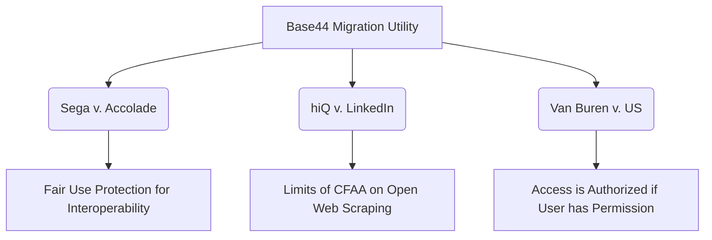

# Legal Risk Analysis & Compliance Framework
## Base44 Codebase Migration Utility (Standalone App Converter)

> [!IMPORTANT]
> **LEGAL PRIVILEGE & DISCLAIMER:** This document compiles a professional legal risk assessment and compliance framework for the development and distribution of the Base44 Standalone App Converter. It is intended for informational and development compliance purposes and does not constitute formal legal advice. Consultation with qualified intellectual property counsel is recommended prior to commercial release.

---

## Executive Summary

The **Base44 Standalone App Converter** (the "Utility") is an automated pipeline designed to help users migrate their proprietary low-code/no-code web applications hosted on the Base44 platform into standalone, standard React/Node.js codebases. The utility operates by:
1. Programmatically logging into the Base44 platform using user-supplied, authorized credentials.
2. Ingesting (scraping) the user's own codebase, configuration files, and database schemas.
3. Cleansing proprietary Base44 wrappers and runtime code.
4. Injecting open-source adapters (such as `react-router-dom` and standard state hooks) to restore application functionality outside the Base44 hosting environment.
5. Pushing the resulting codebase to a Git repository owned by the user.

This document conducts a rigorous legal analysis of the utility's operation, addressing statutory and common-law risks under U.S. law, reviewing critical judicial precedents, defining compliance boundaries, and providing a model user-facing legal disclaimer and safety guidelines document.

---

## Section 1: Credential-Based Access and Session Security

### 1.1 Ingestion Mechanism & Authorization
The utility executes locally on the user's machine. It requires the user to supply their own credentials (`BASE44_EMAIL` and `BASE44_PASSWORD`) or a pre-authenticated session cookie. Using browser automation (Puppeteer/Playwright or similar), the utility logs into `https://base44.io/login` on behalf of the user, accesses their account dashboard, and downloads the application files associated with the user's specific account.

### 1.2 Statutory Analysis: CFAA & SCA

#### A. Computer Fraud and Abuse Act (CFAA), 18 U.S.C. § 1030
The CFAA prohibits accessing a protected computer "without authorization" or "exceeding authorized access." Because the utility acts as a local agent of the user, executing calls using credentials that the user has the legal right to use, it does not bypass technical access controls.
* **Without Authorization**: This prong targets individuals who have no permission to access the system (e.g., external hackers). Because the user is logging into their own account, access is authorized.
* **Exceeds Authorized Access**: Under current jurisprudence, this occurs when an authorized user accesses areas of the system they are strictly prohibited from entering (e.g., another user's database). As long as the utility only retrieves files belonging to the credentialed user, this statutory threshold is not crossed.

#### B. Stored Communications Act (SCA), 18 U.S.C. § 2701 et seq.
The SCA makes it an offense to intentionally access without authorization a facility through which an electronic communication service is provided, thereby obtaining access to a wire or electronic communication while it is in electronic storage.
* **Consent Exception**: Under § 2701(c)(2), access authorized "by a user of that service in the case of a communication of or intended for that user" is fully exempt from liability. The end-user's active entry of credentials and command to migrate their own codebase constitutes express authorization and consent, exempting the utility's local operations from SCA liability.

### 1.3 Key Risks & Mitigation Guardrails

> [!WARNING]
> **Credential Security**: Storing user passwords in plaintext or sending them to a third-party server represents a severe security and liability risk. If credentials are leaked, the utility developers could face negligence claims.

* **Guardrail 1 (Local Processing Only)**: The utility must run entirely client-side. Credentials must never be transmitted, cached, or logged to any server owned by the utility developers. All network requests to the Base44 platform must originate from the user's local IP address.
* **Guardrail 2 (Session-Only Memory)**: Credentials should be stored in volatile memory during execution or read from a local `.env` file that is explicitly added to `.gitignore`.
* **Guardrail 3 (No Multi-Tenant Scraping)**: The utility must enforce strict project isolation. The scraping script must only pull projects associated with the logged-in session's account and must not accept arbitrary resource IDs that belong to other tenants.

---

## Section 2: Interoperability, Reverse Engineering, and Key Legal Precedents

To function as a clean React/Node.js application, the output codebase must remove proprietary Base44 modules and replace them with standard open-source library adapters (e.g., mapping `<Base44Wrapper>` to standard React routing). This conversion requires reverse engineering the functional interfaces of the Base44 wrappers.

The legality of this process is governed by three major U.S. Supreme Court and Appellate precedents:



### 2.1 Precedent Matrix

| Precedent | Relevant Legal Holding | Direct Application to the Utility | Risk Mitigation Strategy |
| :--- | :--- | :--- | :--- |
| **Sega Enterprises Ltd. v. Accolade, Inc.**, 977 F.2d 1510 (9th Cir. 1992) | Disassembly and reverse engineering of copyrighted software is **Fair Use** under 17 U.S.C. § 107 if it is the only way to access functional interface specifications necessary to create an interoperable program. | The utility dissects proprietary wrapper files to understand how they bind states and routes. Under *Sega*, translating these wrapper calls into standard React equivalents to achieve interoperability (running outside Base44) is protected. | **Excision, Not Duplication**: Do not copy Base44's actual wrapper implementation code. The utility must only map inputs and outputs of the wrapper to open-source components. |
| **hiQ Labs, Inc. v. LinkedIn Corp.**, 31 F.4th 1180 (9th Cir. 2022) | Scraping data that is publicly available on the web does not violate the CFAA because public data is not protected by an authorization gate. | Base44 projects are behind an authentication wall, so *hiQ*'s "public data" shield does not apply. Access is governed by private account permissions. | **Explicit Consent**: Rely on the user's explicit credential input as authorization. Never attempt to scrape or access any project that is not explicitly unlocked by the user's valid login session. |
| **Van Buren v. United States**, 141 S. Ct. 1648 (2021) | Under the CFAA, "exceeding authorized access" applies only to accessing information one is forbidden from accessing (a "gates down" approach). Violating a policy or Terms of Service regarding *how* data is accessed does not violate the CFAA if the user is authorized to view that data. | Even if Base44's Terms of Service forbid automated scraping or exporting, a user utilizing the utility to access their own code does not commit a federal crime under the CFAA, as they are authorized to access that code. | **Maintain Authorization**: The utility must never attempt to bypass account permissions, access admin panels, or extract system code that the user does not have permission to view. |

### 2.2 Functional vs. Expressive Code
Under 17 U.S.C. § 102(b), copyright protection does not extend to any "idea, procedure, process, system, method of operation, concept, principle, or discovery." 
* **Expressive Code**: The literal code written by Base44 developers to run their platform or render wrappers (e.g., custom hooks, proprietary state-machines). This is protected by copyright.
* **Functional Code**: The names, arguments, and schemas of the APIs/wrappers that the user's custom application code calls to operate. This is functional interface information.

**Rule of Law**: The utility must strictly limit its operations to reading functional parameters (like component names, props, and configurations) and converting them. It must **never** bundle, clone, or redistribute any of Base44's proprietary libraries, styling frameworks, or server-side packages.

---

## Section 3: Terms of Service (ToS) Conflicts & Safety Boundaries

### 3.1 Typical EULA/ToS Restrictions
Base44's Terms of Service (or End User License Agreement) likely contain clauses that:
1. Prohibit the use of web crawlers, scrapers, indexers, or automated scripts.
2. Restrict the export of compiled assets or raw application files.
3. Assert that application components created on the platform must run exclusively on the platform's infrastructure.

### 3.2 Breach of Contract & Tortious Interference Risks
While *Van Buren* protects the user and the utility developers from criminal CFAA liability, the platform may still pursue civil claims for breach of contract against the user, or claims of **Tortious Interference with Contract** against the developers of the utility.

* **Breach of Contract (User-side)**: A user running the utility is likely in breach of the platform's ToS. This gives Base44 the contractual right to terminate the user's account, delete their projects, and blacklist their IP address.
* **Tortious Interference (Developer-side)**: If the utility developers actively market the tool as a mechanism to bypass Base44 contracts, they could be sued for encouraging third parties to breach their contracts.

### 3.3 Safety Boundaries & Technical Guardrails

> [!CAUTION]
> Failure to implement anti-detection measures and clear warnings exposes both the user (to account bans) and the developer (to litigation) to significant risk.

To minimize ToS conflict risks, the utility must enforce the following safety boundaries:

1. **Human Emulation**: The programmatic browser session must behave like a human user:
   * Implement randomized delays (1000ms - 3000ms) between page loads and asset downloads.
   * Set realistic user-agent strings matching modern browsers (e.g., Chrome/Edge on Windows/macOS).
   * Do not run headless chrome if it triggers the platform's Cloudflare/WAF block page.
2. **Local Excision, Not Platform Manipulation**: The utility must only *read* code. It must never execute write operations on the Base44 server (e.g., deleting projects, modifying database tables, or altering billing details).
3. **No Commercial Wrapper Hosting**: The utility must not set up a competing hosting service that uses modified Base44 runtime components. The output must compile to a standard React/Node template hosted on the user's own servers/GitHub.

---

## Section 4: Nominative Fair Use and Trademark Strategy

The utility must reference the trademark "Base44" to describe what it does (e.g., "migrates from Base44 to React"). However, unauthorized use of a trademark can result in claims of **trademark infringement**, **dilution**, or **false designation of origin** under the Lanham Act (15 U.S.C. § 1114/1125).

### 4.1 The Nominative Fair Use Doctrine
Under U.S. trademark law, the "Nominative Fair Use" defense allows the use of another's trademark to identify the trademark owner's product, provided three requirements are met:

```
                  ┌──────────────────────────────┐
                  │  Nominative Fair Use Test    │
                  └──────────────┬───────────────┘
                                 │
          ┌───────────────────────┼───────────────────────┐
          ▼                       ▼                       ▼
 ┌─────────────────┐     ┌─────────────────┐     ┌─────────────────┐
 │ 1. Necessity    │     │ 2. Minimalism   │     │ 3. No False     │
 │ Cannot identify │     │ Use only the    │     │ Endorsement     │
 │ product without │     │ word mark; no   │     │ Clear disclaims │
 │ naming trademark│     │ logos or colors │     │ of affiliation  │
 └─────────────────┘     └─────────────────┘     └─────────────────┘
```

1. **Necessity**: The product or service must not be readily identifiable without use of the trademark. (The utility cannot describe its conversion capability without naming "Base44").
2. **Minimalism**: Only so much of the mark may be used as is reasonably necessary to identify the product or service. (The utility should only use the text "Base44" and never copy the official logo, graphics, design theme, or typography).
3. **No False Endorsement**: The user must do nothing that would suggest sponsorship or endorsement by the trademark holder.

### 4.2 Brand & UI Compliance Rules

* **Rule 1 (Descriptive Naming)**: The utility must not be named "Base44 Converter" or "Base44 React Utility." It must be named descriptively, highlighting the independent nature of the tool: e.g., **"Standalone React Converter for Base44 Applications"** or **"Migration Pipeline for Base44 Codebases"**.
* **Rule 2 (No Visual Branding Mimicry)**: The utility's dashboard UI must not copy the color scheme, layout, or graphics of the Base44 dashboard. It must use its own distinct visual language (e.g., the designed dark glassmorphic UI).
* **Rule 3 (Trademark Footnote)**: A clear trademark attribution notice must appear on the UI:
  > *"Base44 is a registered trademark of Base44, Inc. This utility is an independent software tool and is not affiliated with, sponsored by, or endorsed by Base44, Inc."*

---

## Section 5: Legal Disclaimer & Safety Guidelines Document

This section contains the official text that must be displayed to users upon first launch of the utility (either in a command-line prompt or a modal on the Extension Dashboard UI) and must be saved in the repository as `LEGAL_DISCLAIMER.md`.

***

# USER LICENSE, SAFETY GUIDELINES, & LEGAL DISCLAIMER
**Last Updated: June 12, 2026**

### 1. READ THIS BEFORE RUNNING THE UTILITY
This migration utility is an open-source, developer-oriented tool designed to extract, cleanse, and convert application codebase configurations into a standalone React/Node.js project structure. 

By executing this utility, you acknowledge and agree to the terms, limitations, and safety boundaries outlined below.

---

### 2. INTELLECTUAL PROPERTY & COMPLIANCE
* **Code Ownership**: You warrant that you are the legal owner of, or have obtained all necessary licenses and rights to, the codebase and assets associated with the Base44 project being migrated. You must not use this tool to retrieve or convert codebases belonging to third parties without their express authorization.
* **Proprietary Software Boundaries**: This utility only extracts user-configured logic, JSON configurations, assets, and structural component layouts. It does not download, copy, distribute, or clone Base44’s proprietary runtime engines, closed-source hosting components, or server-side libraries.
* **Trademark Attribution**: "Base44" is a trademark of Base44, Inc. This utility is an independent, open-source project. It is **not** affiliated with, authorized, sponsored, or endorsed by Base44, Inc.

---

### 3. TERMS OF SERVICE & ACCOUNT STATUS WARNING

> [!WARNING]
> **Use of this utility may violate the Terms of Service (ToS) or End User License Agreement (EULA) of the source platform (Base44).**
> Many platforms prohibit programmatic scraping, automated downloading, or exporting of hosted codebases. By running this utility, you accept the sole risk that your account may be flagged, suspended, or terminated by the source platform.

The developers of this utility are not responsible for:
* Account suspensions, bans, or access restrictions.
* Deletion or loss of data, projects, or assets on the source platform.
* Billing disputes or contract terminations resulting from the use of automated migration scripts.

---

### 4. TECHNICAL SAFETY & RATE LIMITING GUIDELINES
To protect the integrity of the hosting platform's services and avoid triggering automated security systems:
1. **Local Execution**: Only run this tool locally. Do not deploy the scraping engine as a public API or multi-tenant web service.
2. **Emulate Human Behavior**: Do not modify the utility's source code to disable built-in rate-limiting, delay buffers, or human-like interaction loops.
3. **Billing Integrity**: Ensure all active subscriptions and billing cycles with the source platform remain in good standing during the migration. Do not attempt to bypass paywalls or premium feature constraints.

---

### 5. WARRANTY DISCLAIMER & LIMITATION OF LIABILITY
THE SOFTWARE IS PROVIDED "AS IS", WITHOUT WARRANTY OF ANY KIND, EXPRESS OR IMPLIED, INCLUDING BUT NOT LIMITED TO THE WARRANTIES OF MERCHANTABILITY, FITNESS FOR A PARTICULAR PURPOSE, AND NONINFRINGEMENT. 

IN NO EVENT SHALL THE AUTHORS, COPYRIGHT HOLDERS, OR DISTRIBUTORS OF THIS SOFTWARE BE LIABLE FOR ANY CLAIM, DAMAGES, OR OTHER LIABILITY, WHETHER IN AN ACTION OF CONTRACT, TORT, OR OTHERWISE, ARISING FROM, OUT OF OR IN CONNECTION WITH THE SOFTWARE OR THE USE OR OTHER DEALINGS IN THE SOFTWARE, INCLUDING BUT NOT LIMITED TO THE LOSS OF DATA, LOSS OF BUSINESS, ACCOUNT TERMINATION, OR INFRASTRUCTURE FAILURE.

***

## Section 6: Actionable Implementation Plan

To ensure the codebase migration utility conforms to the legal boundaries described in this report, the development team must execute the following modifications:

1. **Verify Cleanser Exclusions**: Use the recipe-driven `decouple-cleanse.py` engine to ensure it permanently deletes all proprietary runtime files via external configuration recipes, leaving no proprietary source code in the migrated repository.
2. **Implement User Consent Prompt**: Modify `index.html` (the Dashboard UI) and the command-line entry script to require users to click "I AGREE" to this Legal Disclaimer before saving credentials or launching the scraping sequence.
3. **Apply Brand Compliance**: Update the repository README and UI headers to replace occurrences of "Base44 Converter" with "Standalone React Converter for Base44 Projects", and add the trademark footnote.
4. **Audit Session Data Logging**: Ensure no debug statements write passwords or session tokens to standard logs or console outputs.
