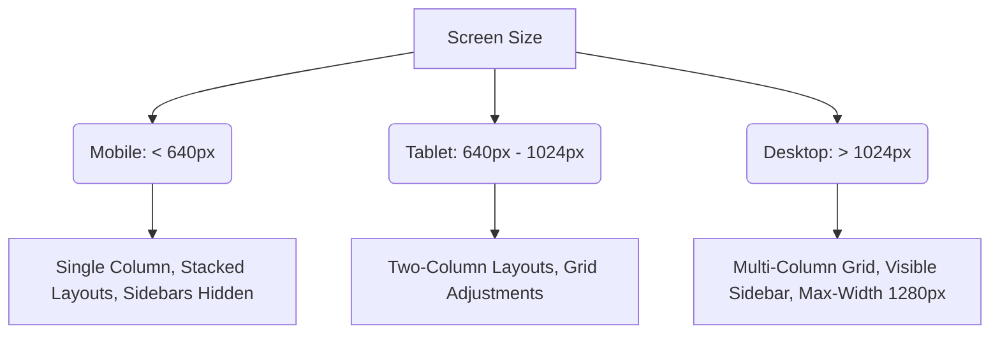

# LiberateJS Brand & Style Guide
This document defines the visual identity, styling guidelines, and brand values for **LiberateJS**—a standalone developer utility designed to convert proprietary web applications into clean, modern, and open React/Node codebases.

---

## 1. Brand Values

LiberateJS is built on four core pillars that guide both its development and its user experience:

*   **Developer Freedom**: Empower developers to escape closed ecosystems. The output code should be standard, clean, and entirely self-contained without vendor lock-in.
*   **Clean Transition**: Codebase transformation must be seamless. Legacy structures should be converted to modern React patterns, leaving no proprietary cruft or custom compiler flags behind.
*   **Efficiency**: Conversion processes, developer tooling, and the final application output must run at peak performance. Fast setup, rapid migrations, and optimized production bundles.
*   **Safety**: Guaranteeing the integrity of the migration. No data loss, strict preservation of application logic, and automated checks to prevent regression.

---

## 2. Color Palette (Sleek Dark Theme)

To appeal to developers, LiberateJS uses a high-contrast, premium dark theme. 

| Role | Color Name | HEX | Preview / RGB |
| :--- | :--- | :--- | :--- |
| **Background** | Deep Charcoal | `#0B0C10` | `rgb(11, 12, 16)` |
| **Surface (Cards/Modals)** | Gunmetal Slate | `#1F2833` | `rgb(31, 40, 51)` |
| **Primary Accent** | Vibrant Emerald | `#10B981` | `rgb(16, 185, 129)` |
| **Secondary Accent** | Cyber Teal | `#06B6D4` | `rgb(6, 182, 212)` |
| **Borders** | Subtle Slate | `#2D3748` | `rgb(45, 55, 72)` |
| **Text (Primary)** | Pure White | `#FFFFFF` | `rgb(255, 255, 255)` |
| **Text (Secondary)** | Muted Gray | `#9CA3AF` | `rgb(156, 163, 175)` |

> [!TIP]
> Use **Vibrant Emerald** (`#10B981`) for successful transformations, active states, and call-to-action buttons. Use **Cyber Teal** (`#06B6D4`) for navigation links, secondary buttons, and information tags.

---

## 3. Typography

LiberateJS uses a modern geometric sans-serif typeface for UI controls and headings, paired with a highly readable monospaced font for code snippets and command terminals.

### Font Families
- **Headings & Display UI**: **Outfit** (from Google Fonts) or fallback to **Inter**.
- **Body Copy**: **Inter** (highly legible at all screen sizes).
- **Code & Terminal Output**: **JetBrains Mono** or fallback to **Fira Code** / **Consolas**.

### Type Scale Hierarchy

```css
/* Styling Reference */
h1 {
  font-family: 'Outfit', sans-serif;
  font-size: 2.5rem;    /* 40px */
  font-weight: 700;
  line-height: 1.2;
}

h2 {
  font-family: 'Outfit', sans-serif;
  font-size: 1.875rem;  /* 30px */
  font-weight: 600;
  line-height: 1.3;
}

h3 {
  font-family: 'Outfit', sans-serif;
  font-size: 1.5rem;    /* 24px */
  font-weight: 500;
  line-height: 1.4;
}

body {
  font-family: 'Inter', sans-serif;
  font-size: 1rem;      /* 16px */
  font-weight: 400;
  line-height: 1.6;
}

code, pre {
  font-family: 'JetBrains Mono', monospace;
  font-size: 0.875rem;  /* 14px */
  line-height: 1.5;
}
```

---

## 4. Visual Layout Rules & Glassmorphism

To present a premium, state-of-the-art aesthetic, the interface relies on clean card layouts, subtle glowing accents, and glassmorphic overlays.

### Glassmorphism Card Formula

For settings panels, status modals, and code previews, use the following glassmorphic recipe:

```css
.glass-panel {
  background: rgba(31, 40, 51, 0.45); /* 45% opacity of Gunmetal Slate */
  backdrop-filter: blur(12px) saturate(180%);
  border: 1px solid rgba(255, 255, 255, 0.08);
  border-radius: 12px;
  box-shadow: 0 8px 32px 0 rgba(0, 0, 0, 0.37);
}
```

### Grid & Spacing
- **Base Grid**: Use an **8px grid system** for all paddings, margins, and component alignments.
- **Card Padding**: Standard card padding should be `24px` (`1.5rem`).
- **Layout Margins**: Main content wrappers should use `32px` (`2rem`) padding on desktop viewports.
- **Gaps**: Use a standard `16px` (`1rem`) gap for card-grid items.

### Responsive Viewports


